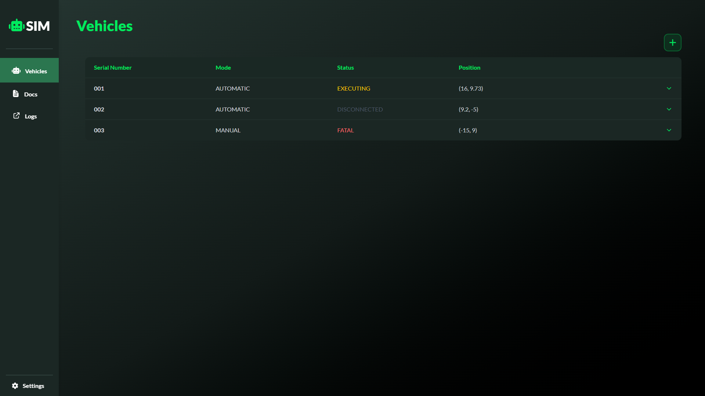

# VDA5050 Vehicle Simulator

A **VDA 5050 compliant** simulation engine for testing and validating AGV/AMR fleet management systems.

[](https://dotnet.microsoft.com/)
[](https://nodejs.org/)
[](https://react.dev/)
[](https://mqtt.org/)

[](LICENSE)

## Overview

This simulator provides a complete testing environment for VDA 5050-compliant vehicle control systems.
It simulates Unmanned Autonomous Ground Vehicles (uAGVs) communicating via MQTT, allowing developers to test fleet management software without requiring physical hardware or complex emulation setups.

The backend simulation engine is built in .NET (C#), while the frontend is developed with React (TypeScript). Communication between these is handled through SignalR, a minimal API, and MQTT messaging for vehicle interactions.



---

### Key Features

| Feature                 | Description                                                         |
| ----------------------- | ------------------------------------------------------------------- |
| **VDA 5050 Compliance** | Full protocol support for orders, state, connection & visualization |
| **Real-time Updates**   | SignalR-powered live UI updates                                     |
| **Time Scaling**        | Adjustable simulation speed (1x - 100x)                             |
| **Multi-Vehicle**       | Simulate entire fleets simultaneously                               |
| **Error Injection**     | Test error handling with WARNING/FATAL states                       |
| **Pairing/Unpairing**   | Simulate uAGV's that connect/disconnect via MQTT                    |
| **Dynamic Fleet**       | Add/remove vehicles at runtime                                      |
| **Order/Stitching**     | Place vda5050 compliant orders (stitching possible)                 |

---

## Getting Started

### Prerequisites

- [Docker Engine](https://docs.docker.com/engine/install/)
- [Docker Compose](https://docs.docker.com/compose/install/)

> **Note:** To develop or modify this project, install [.NET 10](https://dotnet.microsoft.com/en-us/download/dotnet/10.0) and [Node.js 20+](https://nodejs.org/).

### 1. Start the Simulator Stack

From the project root, run:

```bash
docker compose up --build
```

This will start:

- The MQTT broker (Mosquitto)
- The log server (Seq)
- The .NET backend
- The React frontend (as wwwroot)

All services will be available as defined in your `docker-compose.yml`.

---

### 2. Access the Application

- **Frontend:** [http://localhost:8080] (or the port specified in your compose file)
- **Backend API:** [http://localhost:8080] (same port, frontend is hosted in wwwroot)
- **MQTT Broker:** `localhost:1883`
- **Seq server:** `localhost:5341`

**Note:** Swagger is enabled at [http://localhost:8080/Swagger/index.html]

---

### 3. Stopping the Stack

To stop all services, press <kbd>Ctrl+C</kbd> in the terminal, then run:

```bash
docker compose down
```

---

#### MQTT Topics (per uAGV)

| Topic                                        | Description       |
| -------------------------------------------- | ----------------- |
| `uagv/v2/fleet/{SerialNumber}/order`         | Incoming orders   |
| `uagv/v2/fleet/{SerialNumber}/state`         | State updates     |
| `uagv/v2/fleet/{SerialNumber}/connection`    | Connection status |
| `uagv/v2/fleet/{SerialNumber}/visualization` | Position updates  |

## Project Structure

```
VehicleSimulator/
├── VehicleSim.Core/            # 0 dependencies - VDA models and Vehicle class
├── VehicleSim.Core.Tests/      # Unit tests for Vehicle class
├── VehicleSim.Application/     # Simulation engine & fleet manager
├── VehicleSim.Infrastructure/  # MQTT contact/entrypoint
├── VehicleSim.UI/              # SignalR notification service
├── VehicleSim.WebHost/         # Program entrypoint
├── VehicleSim.ClientApp/       # React UI project
├── VdaOrders.txt               # VDA5050 compliant test orders
└── appsettings.json            # Settings and initial vehicles config
```

> **Note:** Since there's no database, vehicles are instantiated via `appsettings.json` or dynamically through the UI at runtime.

---

## Features

### Simulation

- VDA5050 compliant vehicle driving simulation
- Send orders on `/order` topic
- Receive state updates on `/state` topic
- Receive connection updates on `/connection` topic
- Receive frequent position updates on `/visualization`

### Fleet Management

- Initialize multiple vehicles via `appsettings.json` (pre-runtime)
- Add/remove vehicles via UI (at-runtime)
- Set MQTT connection to offline when removing vehicles
- Simulate pairing/unpairing vehicles by sending connection messages.

### Testing & Control

- Inject Fatal and Warning errors
- Publish orders (stitching possible)
- Soft reset a vehicle (reset errors, continue path)
- Hard reset simulation (reset all vehicles to starting values)
- Adjustable simulation timescale for faster/slower driving
- Basic order validation

---

## External Tools

### MQTT Explorer

For visualizing MQTT data flow and publishing orders to a uagv's /order topic.

🔗 [MQTT_Explorer](https://mqtt-explorer.com/)

### VDA5050 Visualizer

If the controller you intend to test with this simulator doesn't have its own visualization set up, you can use an external visualizer that listens on MQTT. Use this to visually validate uagv's behaviour:

🔗 [vda5050_visualizer](https://github.com/bekirbostanci/vda5050_visualizer)

> **Note:** Use the electron variant, websockets for MQTT are not set up.
